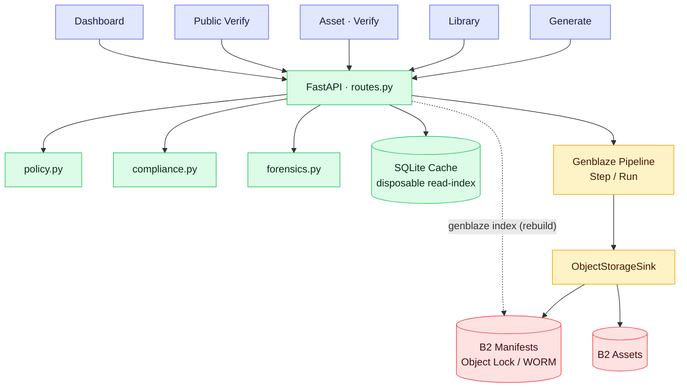
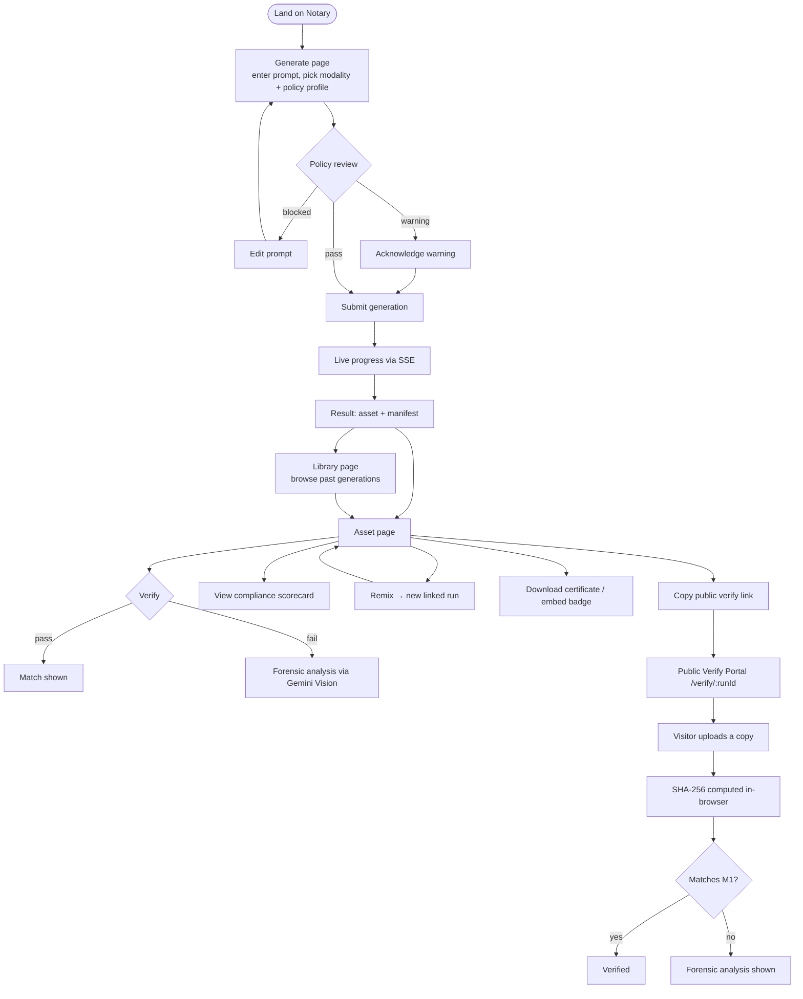
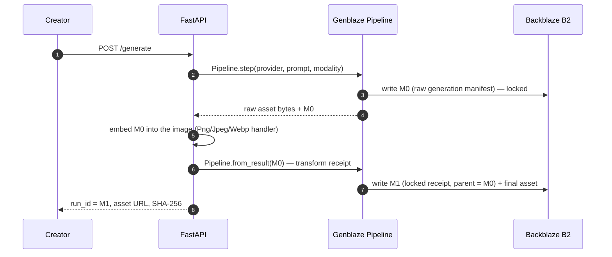
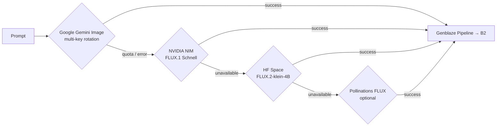
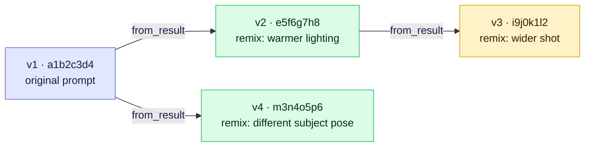

<div align="center">

# Notary

### A birth certificate for every AI-generated image — notarized in B2, verifiable by anyone, in seconds.

**Tamper-evident provenance and regulatory compliance for AI-generated media —
built on Backblaze B2 and Genblaze.**


**Live app:** _add your deployed URL here before submitting_ · **Demo video:** _add link_

**Service docs:** [`backend/README.md`](backend/README.md) · [`frontend/README.md`](frontend/README.md)

</div>

---

Every image or video Notary generates gets a notarized record of exactly how it
was made — provider, model, prompt, parameters, timestamp — locked as a
canonical **Genblaze manifest** in **Backblaze B2**, with Object Lock so the
record can't be altered or deleted, not even by Notary itself.

On top of that record, Notary adds three things that neither Genblaze nor B2
give you out of the box: a **regulatory compliance scorecard**, an
**AI forensic explanation** of what changed when a file fails verification,
and a **public, no-login verification portal** anyone can send a link to.

## What makes Notary different

Genblaze gets you a manifest. B2 gets you durable, locked storage. Neither
tells you if you're legally compliant, what actually changed on a failed
verify, or gives a non-technical stakeholder a link they can check themselves.
Notary's own logic layer does:

| | |
|---|---|
| ⚖️ **Compliance Engine** | Per-asset scorecard against India IT Rules 2026 + EU AI Act Art. 50 — pass/fail/partial, not a checkbox |
| 🔬 **AI Forensic Verification** | On a hash mismatch, Gemini Vision names *what* changed — text overlay, crop, color shift — not just "no match" |
| 🔗 **Public Verification Portal** | A link anyone can open, no login, no account — hash it in-browser, get a real answer |
| 🌳 **Remix Lineage DAG** | Every regeneration is a linked, navigable version chain — not a pile of disconnected files |

## Table of Contents

- [What makes Notary different](#what-makes-notary-different)
- [Why this exists](#why-this-exists)
- [Architecture](#architecture)
- [User flow](#user-flow)
- [How verification works — the M0/M1 chain](#how-verification-works--the-m0m1-chain)
- [Provider resilience](#provider-resilience)
- [Features](#features)
  - [Compliance Engine](#compliance-engine)
  - [AI Forensic Verification](#ai-forensic-verification)
  - [Public Verification Portal](#public-verification-portal)
  - [Policy Engine](#policy-engine)
  - [Remix & Lineage](#remix--lineage)
  - [Also in the box](#also-in-the-box)
- [API surface](#api-surface)
- [Setup](#setup)
- [Providers & models](#providers--models)
- [What Notary does *not* claim](#what-notary-does-not-claim)

---

## Why this exists

Two disclosure regimes for AI media are active right now: India's IT Rules
Amendment 2026 legally defines "synthetically generated information" and
requires visible labeling plus embedded, non-removable provenance metadata.
The EU AI Act's Article 50 marking obligations apply from August 2, 2026.
Marketing, legal, and newsroom teams need a straight answer to "is this
exact file the one our workflow approved?" — Notary gives them a durable
record, a pass/fail verification, and a compliance scorecard against both
regimes, per asset.

## Architecture

Six layers, one direction of truth — the client never writes to B2 directly.



The bottom five layers are Genblaze, B2, and plumbing. The **Notary logic
layer** — `compliance.py`, `forensics.py`, `policy.py` — is the part none of
the underlying SDKs provide.

## User flow

From first prompt to a link a stranger can trust, without ever needing a login:



Everything to the left of the Public Verify Portal requires being in the app;
everything from there down works for anyone with the link and no account.

## How verification works — the M0/M1 chain

An embedded manifest can't also carry the hash of the file that contains it —
embedding the manifest changes the file's bytes, which changes the hash. So
image provenance is a two-record chain:



**M0** is the raw provider-generation manifest, embedded into the image
unchanged. **M1** is a locked receipt whose parent is M0 and whose hash covers
the *final*, post-embed bytes. The public `run_id` is always M1. Verifying a
file extracts and validates M0, validates M1, checks the parent linkage, and
compares the submitted hash to M1 — a single-byte change after embedding fails
the check. Video has no embed step, so it verifies directly against its
canonical manifest.

## Provider resilience



Every successful output — regardless of which stage produced it — still runs
through the same Genblaze pipeline and lands in B2 with the same manifest
guarantees. Video (Veo) runs the same pipeline without this cascade. Exhausting
one Google key doesn't fail a request while another key still has quota.

## Features

| Feature | What it does | Source |
|---|---|---|
| [Compliance Engine](#compliance-engine) | Per-asset scorecard against India IT Rules 2026 + EU AI Act Art. 50 | [`backend/compliance.py`](backend/compliance.py) |
| [AI Forensic Verification](#ai-forensic-verification) | On a hash mismatch, Gemini Vision explains *what* changed | [`backend/forensics.py`](backend/forensics.py) |
| [Public Verification Portal](#public-verification-portal) | No-login link anyone can use to check provenance | [`frontend/src/pages/PublicVerifyPage.jsx`](frontend/src/pages/PublicVerifyPage.jsx) |
| [Policy Engine](#policy-engine) | Pre-generation prompt review + optional post-generation visual audit | [`backend/policy.py`](backend/policy.py) |
| [Remix & Lineage](#remix--lineage) | Version chains via `from_result()`, rendered as a DAG | [`frontend/src/components/LineageGraph.jsx`](frontend/src/components/LineageGraph.jsx) |
| Provenance Certificate | One-click, print-friendly HTML disclosure certificate | `GET /assets/{run_id}/certificate` |
| Embeddable Trust Badge | Shields.io-style SVG badge, live verify status | `GET /badge/{run_id}` |
| Observability Dashboard | Per-provider success rate, latency, live event feed | [`frontend/src/pages/DashboardPage.jsx`](frontend/src/pages/DashboardPage.jsx) |
| B2 Integrity Audit | Paginates every manifest in B2, re-verifies the whole archive | [`backend/audit.py`](backend/audit.py) |

### Compliance Engine

Evaluates a manifest against two live regulatory frameworks and returns a
pass/fail/partial per requirement, plus concrete remediation steps:

- **India IT Rules 2026** — user declaration, visible label, audio disclosure
  prefix, embedded permanent metadata, unique identifier + traceability (5 checks)
- **EU AI Act Article 50** — provider identification, machine-readable mark,
  AI-generated disclosure, provenance traceability (4 checks)

```json
{
  "regulation_id": "eu_ai_act_article_50",
  "checks": [
    { "requirement_id": "EU-ART50-02", "status": "partial",
      "detail": "A machine-readable Genblaze manifest is stored in B2... a C2PA mark embedded in the file itself would fully satisfy the 'industry standard' requirement." }
  ],
  "passed": 3, "total": 4, "compliant": false
}
```

Policy assessment and cryptographic verification are deliberately kept
separate — a compliance pass never implies the file's bytes are authentic.

### AI Forensic Verification

When a submitted copy fails the M1 hash check, Notary doesn't just say "no
match" — it fetches the canonical original from B2, sends both images to
Gemini Vision, and returns a structured, human-readable explanation:

```json
{
  "modifications_detected": ["Text overlay added in lower third", "Color grading shifted warmer"],
  "severity": "moderate",
  "conclusion": "The submitted file is a modified derivative of the canonical asset."
}
```

If Gemini is unavailable, the hash result still returns — forensic analysis
degrades to `null`, never to a false pass.

### Public Verification Portal

`/verify/{run_id}` needs no login. It shows the provenance record (provider,
model, prompt, timestamp, SHA-256), the compliance scorecard, and a
drag-and-drop zone that hashes a file client-side (`crypto.subtle.digest`)
before sending only the hash to the server — the file itself never has to
leave the browser unless verification fails and forensics needs it.

### Policy Engine

Before generation, a deterministic rules engine reviews the prompt against a
selected policy profile (`general` / `public-release` / `brand-safe`) —
blocks explain the matched rule, warnings require acknowledgement, and nothing
is silently rewritten. An optional post-generation Gemini Vision pass can
audit the actual pixels. A disabled or failed audit is reported as
*unavailable*, never as a pass.

### Remix & Lineage

Regenerating from an existing asset with a modified prompt links the new run
to its parent via Genblaze's `from_result()`. The full ancestry — upward to
the root generation, downward to every derivative — is rendered as a
navigable DAG on the asset page:



Every node is its own fully verified M1 asset with its own SHA-256; the edges
are `parent_run_id`, not a guess based on filenames or timestamps. Click any
node on the real asset page and it navigates straight to that run's manifest,
compliance report, and verify action — the DAG is a navigation aid, not just
a picture of one.

### Also in the box

Prompt-level caching (exact-match prompts return instantly instead of
re-running the provider cascade), Server-Sent Events for live generation
progress instead of a blocking spinner, and a `/metrics` + dashboard view
tracking per-provider success rate and latency across every run.

## API surface

<details>
<summary>Full endpoint list</summary>

**Generation**
```
POST /generate                          → run_id, asset URL, manifest, policy audit
POST /generate/stream                   → same, as Server-Sent Events
POST /policy/prompt-review              → pre-generation policy check only
```

**Assets & verification**
```
GET  /assets?limit=&provider=&modality= → library list (SQLite cache)
GET  /assets/{run_id}                   → full manifest + asset URL
POST /assets/{run_id}/verify            → {match, computed_hash, manifest_valid, forensic?}
POST /assets/{run_id}/remix             → new run via from_result()
GET  /assets/{run_id}/compliance        → ComplianceReport
GET  /assets/{run_id}/lineage           → DAG nodes + edges
GET  /assets/{run_id}/certificate       → downloadable HTML certificate
GET  /badge/{run_id}                    → embeddable SVG trust badge
```

**Public portal — no auth**
```
GET  /public/verify/{run_id}            → provenance + compliance, no secrets
POST /public/verify/{run_id}            → {file_hash} → match result
POST /public/verify/{run_id}/file       → full file check + forensics on mismatch
```

**Admin & observability**
```
POST /admin/reindex                     → rebuild SQLite cache from B2
POST /admin/audit                       → re-verify every manifest in B2
GET  /metrics                           → per-provider success/latency
GET  /health                            → per-key status across the Google pool
```

</details>

## Setup

Prerequisites: Python 3.11+, Node 18+, and a Backblaze B2 bucket **created
with File Lock enabled** — this cannot be retrofitted on most tiers, so
enable it before writing a single object.

```bash
cd backend
python -m venv .venv
source .venv/bin/activate
pip install -r requirements.txt
cp .env.example .env
# fill in B2 credentials, File Lock settings, and at least one provider key
uvicorn main:app --reload --port 8000
```

```bash
cd frontend
npm install
npm run dev
```

Open `http://localhost:5173`. For browser previews from a private bucket,
either configure `B2_PUBLIC_URL_BASE` for an approved public/CDN URL or put a
signed-URL proxy in front of B2.

<details>
<summary>Key environment variables</summary>

| Variable | Required | Notes |
|---|---|---|
| `B2_KEY_ID` / `B2_APP_KEY` / `B2_BUCKET_NAME` | Yes | Scoped key — never the account master key |
| `B2_OBJECT_LOCK_ENABLED` / `B2_OBJECT_LOCK_MODE` | Yes | Must match the bucket's actual File Lock config |
| `GOOGLE_API_KEYS` | Yes (one provider min.) | Comma-separated, rotated in order on quota errors |
| `NVIDIA_API_KEY` | Optional | Secondary image fallback |
| `HF_TOKEN` | Optional | Improves public Space quota only — never stored in B2 |
| `POLLINATIONS_API_KEY` | Optional | Final image fallback |
| `POST_GENERATION_VISUAL_AUDIT` | Optional | Off by default so generation never silently spends a second model quota |

</details>

## Providers & models

| Role | Provider | Model |
|---|---|---|
| Image (primary) | Google | `gemini-2.5-flash-image` |
| Image (fallback) | NVIDIA NIM | `black-forest-labs/flux.1-schnell` |
| Image (fallback) | Hugging Face Space | `black-forest-labs/FLUX.2-klein-4B` |
| Image (fallback, optional) | Pollinations | `flux` |
| Video | Google | `veo-3.0-generate-001` |
| Forensics | Google | `gemini-2.0-flash` (Vision) |

## What Notary does *not* claim

Notary embeds a Genblaze manifest and locks it with B2 Object Lock — it does
**not** claim C2PA signing or standards certification. Compliance checks
report what a manifest can observe, not a legal guarantee. Policy review is
explainable rule-matching, not a safety guarantee. These boundaries are
enforced in code, not just in this paragraph — `has_visible_label` and
`has_embedded_metadata` default to `False` until explicitly set after a real
embed step, so a gap shows up as a gap, never as a silent pass.