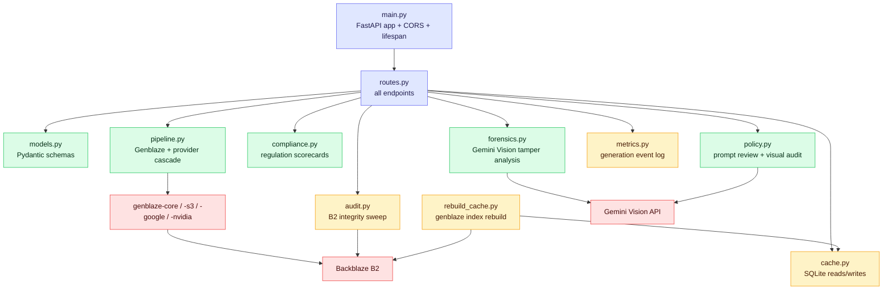
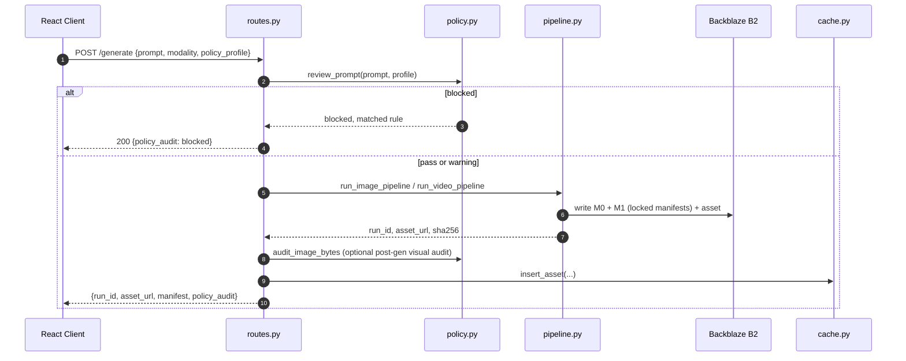

# Notary — Backend

FastAPI service that owns every provider credential, runs the Genblaze
pipeline, and is the only thing that talks to Backblaze B2. See the
[root README](../README.md) for the product-level picture and the
[frontend README](../frontend/README.md) for the client.

## Table of Contents

- [Module map](#module-map)
- [Request lifecycle — `/generate`](#request-lifecycle--generate)
- [Directory structure](#directory-structure)
- [API surface](#api-surface)
- [Setup](#setup)
- [Tests & spikes](#tests--spikes)

## Module map

`routes.py` is the only file the frontend talks to; everything else is
composed underneath it.



## Request lifecycle — `/generate`



A blocked prompt never reaches the pipeline — no B2 write, no provider call,
no cost. A warning requires client-side acknowledgement before the request is
resent with `policy_acknowledged: true`.

## Directory structure

```
backend/
  main.py            FastAPI app, CORS, DB lifespan hooks, /health
  routes.py           All HTTP endpoints (see API surface below)
  models.py            Pydantic request/response schemas
  pipeline.py          Genblaze integration + multi-key rotation + provider cascade
  policy.py             Deterministic pre-gen prompt rules + optional Gemini visual audit
  compliance.py       India IT Rules 2026 + EU AI Act Art. 50 scorecards
  forensics.py          Gemini Vision tamper analysis on hash mismatch
  cache.py              SQLite schema + read/write helpers (disposable index)
  metrics.py            Per-generation event log for the dashboard
  audit.py               Full B2 manifest re-verification sweep
  rebuild_cache.py    CLI: rebuild the SQLite cache from B2 via genblaze index
  requirements.txt
  .env.example
  spikes/                Day 1/2 throwaway validation scripts (not imported by the app)
  tests/                  Regression tests for the receipt chain, cascade, and policy engine
```

## API surface

| Group | Endpoint |
|---|---|
| Generation | `POST /generate`, `POST /generate/stream`, `POST /policy/prompt-review` |
| Assets | `GET /assets`, `GET /assets/{run_id}`, `POST /assets/{run_id}/verify`, `POST /assets/{run_id}/remix` |
| Compliance & lineage | `GET /assets/{run_id}/compliance`, `GET /assets/{run_id}/lineage`, `GET /assets/{run_id}/certificate`, `GET /badge/{run_id}` |
| Public portal | `GET /public/verify/{run_id}`, `POST /public/verify/{run_id}`, `POST /public/verify/{run_id}/file` |
| Admin & observability | `POST /admin/reindex`, `POST /admin/audit`, `GET /metrics`, `GET /health` |

Full request/response shapes live in [`models.py`](models.py); the
[root README](../README.md#api-surface) has the same table with one-line
descriptions per endpoint.

## Setup

```bash
python -m venv .venv
source .venv/bin/activate        # .venv\Scripts\activate on Windows
pip install -r requirements.txt
cp .env.example .env             # fill in B2 + at least one provider key
uvicorn main:app --reload --port 8000
```

Requires a B2 bucket created **with File Lock enabled at creation** — see the
root README's [Setup](../README.md#setup) section for why this can't be
retrofitted, and the env var table there for what each variable controls.

## Tests & spikes

- `tests/` — `test_embedded_receipt.py` (M0/M1 chain against a corrupted
  file), `test_image_cascade.py` (provider fallback ordering), `test_policy.py`
  (block/warn rule matching). Run with `pytest` from `backend/`.
- `spikes/` — throwaway Day 1/2 scripts (`discovery.py`, `spike_imagen.py`,
  `spike_object_lock.py`, etc.) used to confirm real Genblaze class names,
  model IDs, and B2 Object Lock behavior before wiring them into the app.
  Not imported by `main.py` — kept in the repo as a record of what was
  actually verified, not assumed.