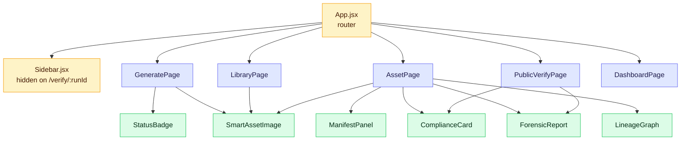
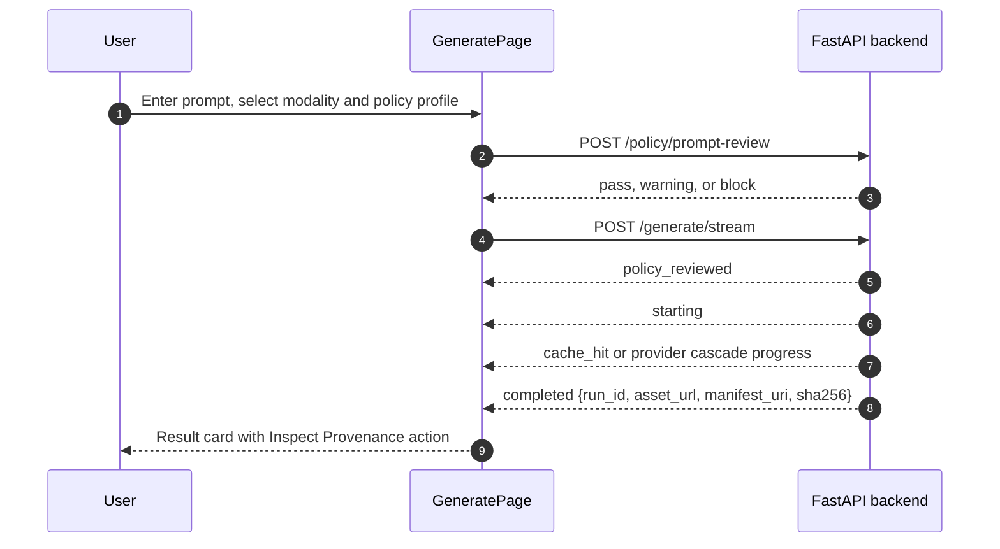

# Notary Frontend

React + Vite client for Notary Genblaze. The browser talks only to the
FastAPI backend through a single Axios client; it never writes directly to
Backblaze B2.

See the [root README](../README.md) for product architecture, provenance,
provider cascade, and backend setup.

## Table of Contents

- [Component Map](#component-map)
- [Data Flow: Live Generation](#data-flow-live-generation)
- [Routes](#routes)
- [Directory Structure](#directory-structure)
- [Design System](#design-system)
- [Setup](#setup)
- [Checks](#checks)

## Component Map



`ComplianceCard` and `ForensicReport` are shared between the authenticated
asset view and the public verification portal. `SmartAssetImage` provides a
polished fallback when an asset URL expires or fails to load.

## Data Flow: Live Generation



The generation page consumes Server-Sent Events so long image/video runs can
show cascade progress instead of a static blocking spinner. If the backend
returns `completed`, the result card links to `/assets/:runId`.

## Routes

| Path | Page | Purpose |
|---|---|---|
| `/` | `GeneratePage` | Prompt entry, policy review, live generation stream |
| `/dashboard` | `DashboardPage` | Provider health, success rate, latency, recent events |
| `/library` | `LibraryPage` | Filterable generated asset library |
| `/assets/:runId` | `AssetPage` | Manifest, media preview, compliance, verification, remix lineage |
| `/verify/:runId` | `PublicVerifyPage` | No-login public verification portal |

The sidebar is hidden on `/verify/:runId` so shared public links render as a
standalone trust page.

## Directory Structure

```text
frontend/
  index.html
  package.json
  vite.config.js
  tailwind.config.js
  public/
    favicon.svg
    icons.svg
  src/
    main.jsx
    App.jsx
    index.css
    api/
      client.js
    components/
      ComplianceCard.jsx
      ForensicReport.jsx
      LineageGraph.jsx
      ManifestPanel.jsx
      Navbar.jsx
      Sidebar.jsx
      SmartAssetImage.jsx
      StatusBadge.jsx
    pages/
      AssetPage.jsx
      DashboardPage.jsx
      GeneratePage.jsx
      LibraryPage.jsx
      PublicVerifyPage.jsx
```

`Navbar.jsx` is still present, but the active app shell is `Sidebar.jsx`.

## Design System

The app uses a dark operational UI defined mostly in `src/index.css`, with
Lucide icons for buttons and navigation. The public verification page keeps a
more standalone certificate/trust feel while reusing the same API contracts.

Asset detail pages include:

- media preview through `SmartAssetImage`
- compliance scorecards
- manifest/provenance panels
- remix lineage DAG navigation
- certificate, public link, and badge actions

## Setup

Install dependencies and start the Vite dev server:

```bash
cd frontend
npm install
npm run dev
```

Open `http://localhost:5173`.

The frontend defaults to `http://localhost:8000` for the backend. Override it
with `VITE_API_URL` when needed:

```bash
# frontend/.env
VITE_API_URL=http://localhost:8000
```

From the repository root, you can also run both frontend and backend with
Docker Compose:

```bash
docker compose up
```

That exposes the frontend at `http://localhost:5173` and the backend at
`http://localhost:8000`.

## Checks

```bash
npm run build
npm run lint
```

`npm run build` should pass before pushing frontend changes. `npm run lint`
uses Oxlint when dependencies are installed.
