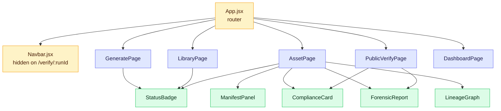
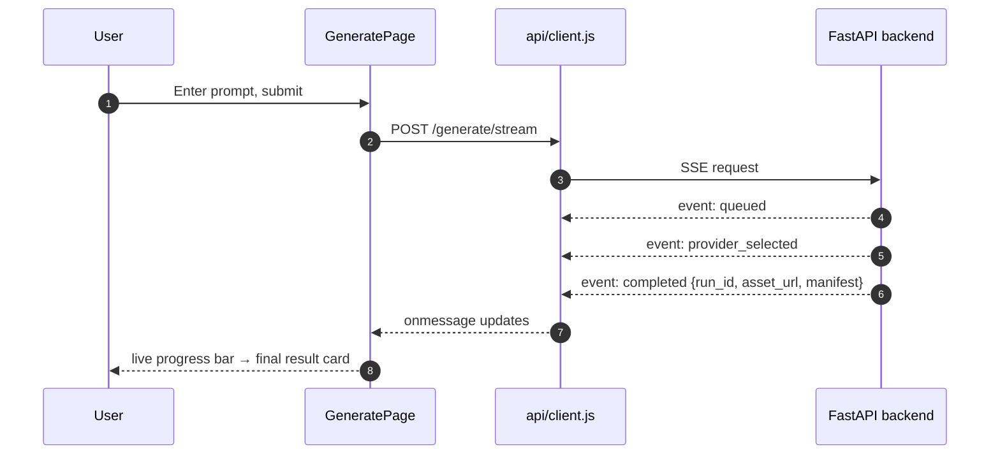

# Notary — Frontend

React (Vite) client. Five routes, all reading and writing through a single
Axios instance — the client never talks to Backblaze B2 directly. See the
[root README](../README.md) for the product-level picture and the
[backend README](../backend/README.md) for the API it calls.

## Table of Contents

- [Component map](#component-map)
- [Data flow — live generation](#data-flow--live-generation)
- [Routes](#routes)
- [Directory structure](#directory-structure)
- [Design system](#design-system)
- [Setup](#setup)

## Component map



`ComplianceCard` and `ForensicReport` are shared between the authenticated
`AssetPage` and the no-login `PublicVerifyPage` — same components, same data
shape, rendered in two different trust contexts.

## Data flow — live generation



Video generation can take minutes; the SSE stream is what keeps the UI
showing real progress instead of a spinner over a blocking request.

## Routes

| Path | Page | Auth |
|---|---|---|
| `/` | `GeneratePage` | app |
| `/library` | `LibraryPage` | app |
| `/assets/:runId` | `AssetPage` | app |
| `/verify/:runId` | `PublicVerifyPage` | none — Navbar hides itself here |
| `/dashboard` | `DashboardPage` | app |

## Directory structure

```
frontend/
  src/
    main.jsx                  Entry point
    App.jsx                    Router + route table
    api/
      client.js                 Axios instance, 2-min timeout for video gen
    pages/
      GeneratePage.jsx        Prompt input, policy profile, live SSE result
      LibraryPage.jsx           Filterable list backed by the SQLite cache
      AssetPage.jsx               Full manifest + compliance + forensics + lineage
      PublicVerifyPage.jsx      No-login portal, drag-and-drop hash verify
      DashboardPage.jsx        Per-provider health, latency, live event feed
    components/
      Navbar.jsx                  Top nav, hidden on the public portal
      StatusBadge.jsx             Small pill: modality / compliance / verify status
      ManifestPanel.jsx           Collapsible raw manifest + provenance fields
      ComplianceCard.jsx        Regulation scorecard (India IT Rules / EU AI Act)
      ForensicReport.jsx           Tamper analysis result, severity-coded
      LineageGraph.jsx              Interactive SVG remix/version DAG
```

## Design system

Dark theme by default (`index.css` root variables); `PublicVerifyPage`
overrides to a light, high-contrast palette on purpose — the certificate/
trust context reads differently from the main working app, so it gets its
own visual register instead of inheriting the dashboard's dark UI.

## Setup

```bash
npm install
npm run dev
```

Open `http://localhost:5173`. Point `VITE_API_URL` at the backend if it's not
on `localhost:8000` (see [`api/client.js`](src/api/client.js)):

```bash
# .env in frontend/, optional — defaults to http://localhost:8000
VITE_API_URL=http://localhost:8000
```